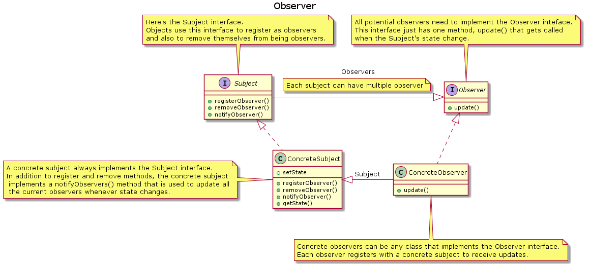

#Observer Pattern

##Definition
The Observer Pattern defines a one-to-many dependency between objects so that when one object changes state, all its dependents are notified and updated automatically.

Work like a newspaper subscription:
1. A newspaper publisher goes into business and begins publishing newspapers.
2. You subscribe to a particular publisher, and every time there's a new edition it gets delivered to you. As log as you remain a subscriber, you get new newspapers.
3. You unsubscribe when you don't want papers anymore, and they stop being delivered.
4. While the publisher remains in business, people, hotels, airlines and other business constantly subscribe and unsubscribe to the newspaper.

The subject and observers define the one-to-many relationship. The observers are dependent on the subject such that when the subject's state changes, the observers get notified. 
Depending on the style of notification, the observer may also be updated with new values.

##Loose coupling
When two objects are loosely coupled, they can interact, but have a very little knowledge of each other.

**The Observer Pattern provides an object design where subjects and observers are loosely coupled.**
The only thing the subject knows about an observer is that it implements a certain interface (the Observer interface). It doesn't need to know the concrete class of the observer, what it does, or anything else about it.

**We can add/remove/edit observers at any time**

**We never need to modify the subject to add new types of observers**
The subject doesn't care about the observers.

**We can reuse subjects or observers independently of each others**
If we have another use for a subject or an observer, we can easily reuse them because the two aren't tightly coupled.

**Changes to either the subject or an observer will not affect the other.**

**Loosely coupled designs allow us to build flexible OO systems that can handle change because they minimize the interdependency between objects.**

>**Design principle:** Strive for loosely couple designs between objects that interact.

##UML representation

[PlantUML URL](http://plantuml.com/plantuml/uml/jLCzRzim4DtpAsvhWiRw0HuA54M1TigGZbfewMmnfOu2x-J0QFlVUwH4YR8Je4ir2VVvxhr7002nuX2U3epXZE7kJaDWIJ0SJOFmF1vUi17ubUBn-nZmP5dpkUN-eSpr_enlPSYBFLwkCd-kr-LykMySMYEuxMYSOOOldfg0WlyNPCgSK9vbXP5YFCVU1_QlvzpKxnmUPVVxqys9-wp8sttLE5JQjQWPYtBhBjXJbuOkvVlbbrEfte_W2PobdtluQfeEUEvk345dpWZzwCGEQXbVBhd6EGF9ODVfuWVmnvpOmpSC-851kjLhYnqggEafnHX6rjxESc4MyP1b1iCB7gx9K0l6iPzAejfnGS_epiXm3Bw70rewhJrL0J5o7p5UtRI7pz3CeOKMurxDHK7roaYF9EzTKjDt0jEsLgpokq6kM6UCFKhdMtvCCwvNrLHkCR3rAjy_pEtQR7HpOgoDcoR3ALAd8zBaCGGTiXuFhnqIHaDmz3CqdQ4JRZYPPSlhb0ldOD0CYJMk64KuRLsmffMBuo8ZCo4_jcg-Z2pgCDMHCXEFa1_BT9G-GbOZEeTjJH5pIRQQg4HVhTWFNaGLBnHTpyYHueBez8FoHPVvDK-4RXNU79GbJWyc3reKLdgjTAhOZNcI3HgqAlrqA5T_0G00)
