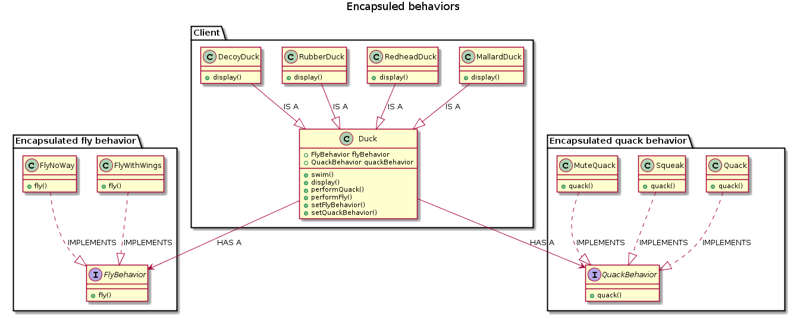
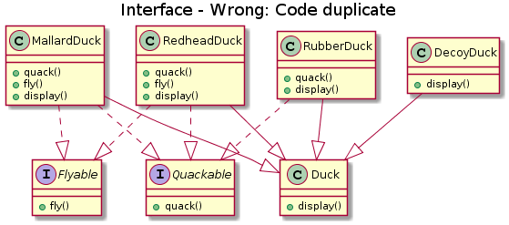
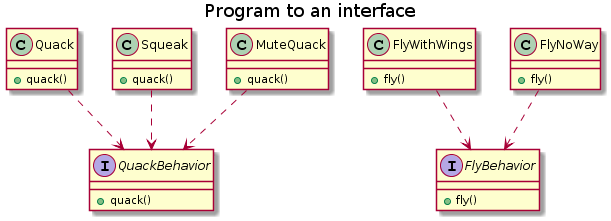

# The strategy pattern
## Definition
The Strategy Pattern defines a family of algorithms encapsulates each one, and make them interchangeable. 
Strategy lets the algorithm vary independently from clients that use it.

## UML representation

[PlantUML URL](http://plantuml.com/plantuml/uml/bPFDJeD04CVlFCMc9urf7w07asencaYZOjBp58QowPQlNJH4--vkANHd4P7k2MP-C_kVZrLS2MHk4a0cIu4Xss0C7pmjfEDa4EnWYsnoBpWcQiA-7APF841AjYo3NMCudfi7KTqreImotmPuBNMwCvBJFmF9Jxw_kZR_8PUPW8gQCYoYjDZNwNhiMWUrIbH4MSTZIMfy1rAZ1q904NPBjKKT71BnXc6CS554kTbWSK704eEq6iLJ-TFfzsqzipbxyjcYzbEnlNuZhSzjX7Iz-dwpFErkWTBRfJVZl67jFl54wT51W8pk42ak4hsDqFIQgtZDawqSXw_IDLI3g9LpDjDbKKswFE_bsVNSrRlVugUSmwXEtlJ9WkRiSN5irn-zgf_8GBVi1qMgoidJi5fGHumY_Rn468TwfS8nYKzCtIXR-Q-kDfUFGStb_z5q1XRMJk47)

## When
**Identify the aspects of your application that vary and separate them from what stays the same.**
If some aspect of the code is changing, then you have a behavior that needs to be pulled out and separated from all the non-changing stuff.
To deal with it take the parts that vary and encapsulate them, so that later you can alter or extend the parts that vary without affecting those that don't.
The result are fewer unintended consequences from code changes and more flexibility in your systems!

**This is the basis for almost every design patterns.**


## How to use the strategy pattern

### The problem:
    

[PlantUML URL](http://plantuml.com/plantuml/uml/hP6_3e8m4CPtdk96ZO47S72Hc3WuwE9yj8SsN01BEn3rtGLYf1GY3dPgxlj-znS0m2Z31FlSa4vH48HmraL-MSEsa0JIbgm46Wg2nWlgOpjQ51ac3NhlbFQjRcrmiUm2Jv_OSUtxKww7Ri5OLH1RaRasgQgIST9wG6RKqYVSHhnASnbF9A-4VyreauJqRC8l6M8IHVtJLjnzHD5ZqzzfMduVfHFToIVOaJnW-nazT5Gt31kz_VdWKEXdzW2dZLvv0G00)
Wrong: Code duplicate !

### The solution

**Program to an interface, not an implementation**

The solution:

[PlantUML URL](http://plantuml.com/plantuml/uml/ZP3B2i8m44Nt_OfPAa8_mOKBTuhYekiXJDjWJ6WUXI3-koPHQch1P9USSpF31G2mt0g2arQTnXjO1IY1IqkwHKPLzJAcAvmTikkEUXovqd2FD9pD4C1g7HyUyzHU-ALCAtoUO0AD2NR3RTzmsPao_QWQz0LgtFxFricy38wmJ3quIoKV9wUkjtc9aRt7BSDfm2-FGbPOSBxw_WYfeZby0W00)


Use interface to represent changing behaviors.


Programming to an implementation would be:
```java
Dog d = new Dog();
d.bark();
```

Programming to an interface / supertype would be:
```java
Animal animal = new Dog();
animal.makeSound
```

```java
a = getAnimal();
a.makeSound();
```
Advantage:
We don't know what the actual animal subtype is, we only need to invoke makeSound():


### Composition vs Inheritance
HAS-A = Composition
IS-A = Inheritance

**Favor composition over inheritance**
Composition allow more flexibility. Let you encapsulate a family of algorithms into their own set of classes and **change behavior at runtime**.
Composition is used in many design patterns.